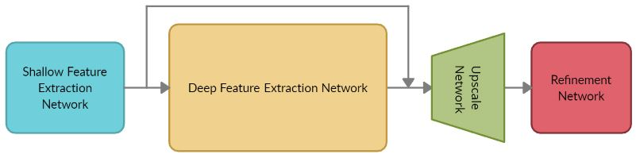
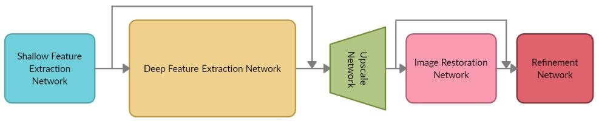
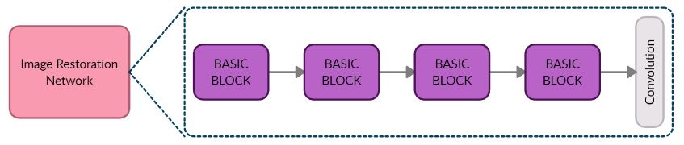
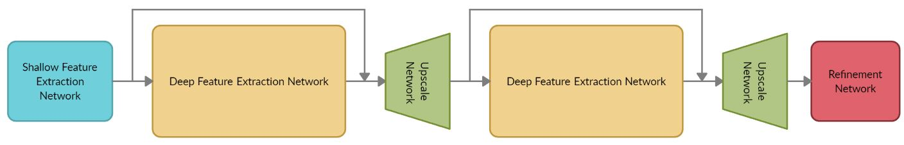

# Modified ESRGAN for solving the Super Resolution Problem
 
We present a PyTorch Lightning implementation of the [ESRGAN](https://arxiv.org/pdf/1809.00219.pdf) with the supplementary usage of the Wasserstein Loss.

  </img>
  
ESRGAN

In addition, we have also introduced two modified models of the ESRGAN.

The full explanation of these models, the dataset used for the training and the validation phases and the results obtained on the Set5 are shown in this [Google Colab Notebook](https://colab.research.google.com/drive/18OlSyFmXV3yE6B_baPHN-psWyn_5bPD3?usp=sharing).

## Our models

**ESRGAN+IR**:

  </img>
  
ESRGAN+IR

In which we have simply added an *Image Restoraion* block between the *Upscale* and the *Refinement* networks.

  </img>
  
Zoom on the IR block

**DRGAN**:

  </img>
  
DRGAN

Where we modified the structure of the generator: instead of upsampling directly to the dimension of the output, we double the input's dimension and then we apply in sequence a Deep Feature Extraction Network and an Upscale Network that doubles again the input's dimension in order to match thefinal resolution.

## Weights:

The pre-trained weights of these models can be downloadad at this [link](https://drive.google.com/drive/folders/1nkULIOT1WYE1VzjdsnNJ2lnd_qUKf8IX?usp=sharing).

## Team:

Emanuele Iacobelli: [GitHub](https://github.com/IacobelliEmanuele), [Linkedin](https://www.linkedin.com/in/Emanuele-Iacobelli/) 

Mario Edoardo Pandolfo: [GitHub](https://github.com/JRhin), [Linkedin](https://www.linkedin.com/in/jrhin)
